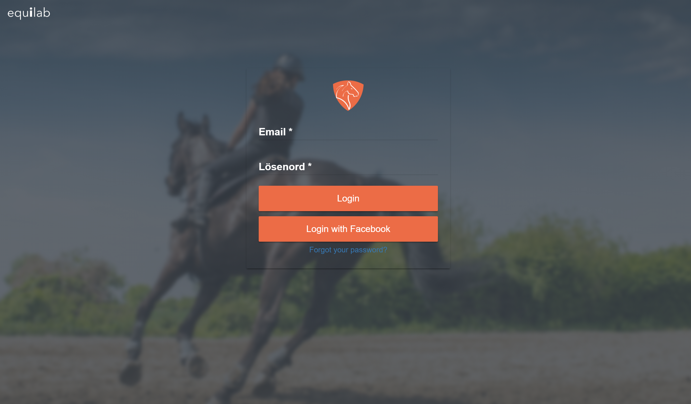
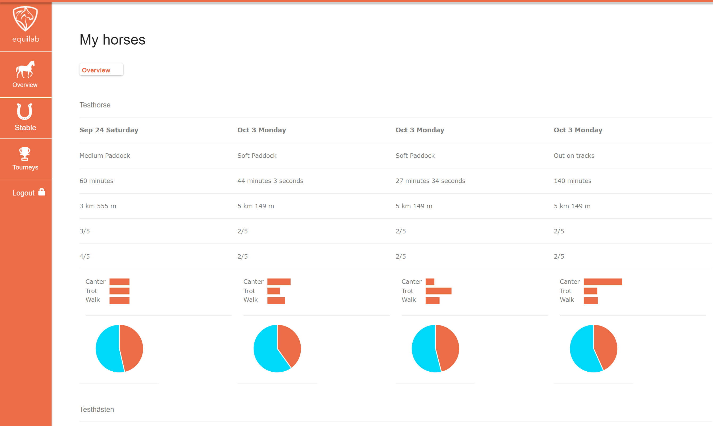

# Angular2 AngularFire test project
A web application in angular2

Contains various functions made in AngularFire such as login, create user and loops to retreive nested data from the current logged in user in your Firebase database.

Theres also an example on an authentication guard which prevents non registered users from accessing restricted pages.

See demo at: https://paem.github.io/angular2-project

To login:

Email = test@test.se

Password = password123

# Pictures

